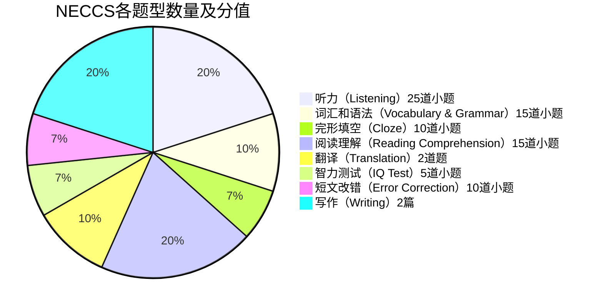
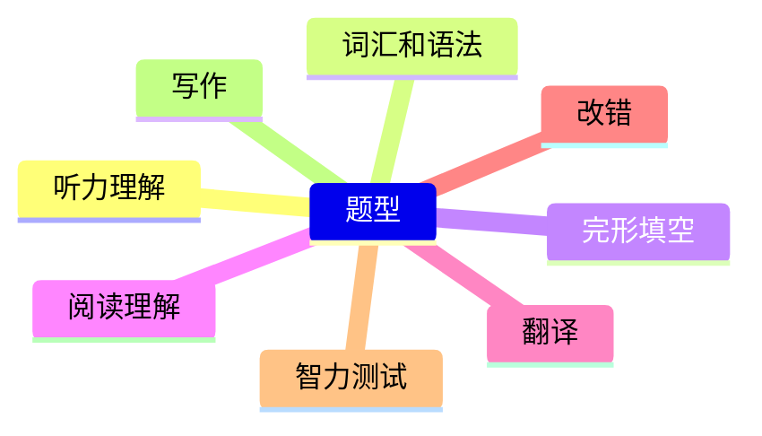

# Welcome to NECCS!

演讲人：廖炳诚

时间：2025年4月7日


--- #2
transition: slide-left
layout: two-cols
---

# 目录


- 一、NECCS是什么？🤨
- 二、NECCS的做题策略是？🛠
  - NECCS题型及特点 🧱
  - NECCS整体做题顺序与取舍 📋🔍
  - NECCS阅读答题技巧 🖋
- 三、参考资料📝


::right::

  收获可能会更多的听众
  
<v-clicks>
  
- 做过NECCS的**样题**（最好是**模拟考试状态**下的**完整一套**）或者**相关练习题** 📚
- 参加过NECCS**考试**的⭐
- 对NECCS的总体战略性做题**技巧**感兴趣的 🏸
- > PS:细节性的解析，个人以为网上资料是很全面且详尽的，故略过，除却**阅读部分**个人做下简单分享
 
</v-clicks>

<v-click>

内容可能较干⚠，小惊喜🎁留在文末

</v-click>

---#3
layout: full
---

<v-click>

简单介绍自己（自我感觉是lucky dog, 躺了🛏️）

</v-click>

<v-after>

- 2024“外研社.国才杯”“理解当代中国”全国大学生外语能力大赛校赛 英语组 综合能力 赛项 铜奖
- 2023“外研社.国才杯”“理解当代中国”全国大学生外语能力大赛校赛 英语组 阅读 赛项 特等奖
- 2023年全国大学生英语竞赛（NECCS）C类一等奖
- 四级535 六级531

</v-after>

--- #4
layout: section
---

# NECCS是什么？


--- #5
transition: slide-down
layout: full
---

# NECCS是什么？

全国大学生英语竞赛(National English Competition for College Students, 简称NECCS)是由高等学校大学外语教学研究会和全国高等师范院校外语教学与研究协作组联合主办，英语辅导报社、考试与评价杂志社承办的大学生英语综合能力竞赛。


竞赛分A、B、C、D四个类别

- A类考试适用于研究生参加；
- B类考试适用于英语专业本、专科学生参加；
- **C类**考试适用于<span v-mark.circle.orange="1">非英语专业本科生</span>参加；
- D类考试适用于体育类和艺术类的本科生和非英语专业高职高专类学生参加。

<div v-click="2">
  <span v-mark.underline.orange="2" style="font-size: 24px;">
  也就是说，我们这里只需要关注C类即可💡
  </span>
</div>

--- #6
layout: iframe
url: https://www.chinaneccs.cn/
---

--- #7
transition: slide-left
layout: section
---
# NECCS的做题策略是？


--- #8
transition: fade-out
layout: full
---

# NECCS题型及特点





---#9
transition: slide-left
layout: two-cols
---

# NECCS题型及特点



- 共计**84**道题，综合考察**读**、**听**、**说**、**写**、**译**五方面的技能和**英语的综合运用能力**😟
- 考试时间只有**120**分钟！！！😥

::right::


<v-clicks>

- **时间紧**🕙 **题量大**😪 **题型多**💬 
- 要有**整体观念**，适当**舍弃**🔪
- **应试技巧**起到的作用很大🍎
- 在**有限时间**内，做得**多**，做得**对**就可以胜出💪
- 复杂题型下，**做题顺序**该怎么安排🧭
- 具体题型，在保证**得分率**的基础上怎样做得更**快**⭐

</v-clicks>

--- #10
transition: fade-out
---

# NECCS做题顺序与取舍

````md magic-move

```js

允许作答之前或者刚正式开考：✨

- 过一遍卷子 🏅
- 听力审题 🏆
- 看智力测试题或者改错题 🥈
```

```js

为什么先过一遍卷子 ❓

```

```js {1|3-5|3-8|all}
为什么先过一遍卷子 ❓

大致浏览对整套卷子的难度有大致了解，对考查的内容有一个模糊的印象 🔺
- 扫一下阅读题都大概跟什么话题相关 🚩
- 看一下写作的大小作文的主题是什么，图表题/论述题跟什么相关 🚩

这一行为尽量在 1 - 2 分钟内完成🕚，无论正式开考考前允不允许看卷子
（这个能不能看卷子的细节被我不小心忘掉了😥）

```

```js

然后，你就需要对听力进行审题，怎么审题？🧭

```

```js{1|3-5|3-9|all}
然后，你就需要对听力进行审题，怎么审题？🧭

- 根据选项猜话题 💬
- 特别留意带有数字、日期、性别、姓名的选项 🌐
- Section B的第二个填词部分，猜词性 ❔

这样审题审下来，做听力的准备工作就是做到极致了。🎯

Note:通常是边做题，边利用空隙审下一道听力题，审题需要做适当的标注🖊

```

```js

不能动笔🔏的时候，要怎么做呢 ❓

```

```js{1|2|2-6|2-8|all}
不能动笔🔏的时候，要怎么做呢 ❓

假如允许看卷子的话，就去看智力题或者改错题。👌

这两种题的特点是你不需要过多的准备工作，作答时也不吃你的应试技巧👍
对于审题的标注的需求可以说是约等于无，可以短期记忆记下来。✊

很适合拿考前可以看试卷但不能动笔的时间去磨。⚡

```

```js
答题优先级：✨

- 听力（Listening）🏆
- 词汇和语法（Vocabulary & Grammar）🥈
- 完形填空（Cloze）🥈
- 阅读理解（Reading Comprehension）🏅
- 写作（Writing）🏆
- 短文改错（Error Correction）🏅
- 智力测试（IQ Test）🥉
- 翻译（Translation）🥉

```

```js

为什么这么安排呢 ❓

```

```js{1|3|5-6|8-9|8-10|12|12-14|all}
为什么这么安排呢 ❓

听力肯定是最开始要做的，想都不用想 ✔

沿着顺序做词汇和语法、完形填空和阅读理解是必要的 ✔
这三个加起来占分比约莫可达 37 %，也没有被舍弃的理由 ❗

然后就是做写作，很简单 🤔
这个时候，你的时间差不多用掉一半了，记得我们前面说的吗 ❔
在有限时间内，做得多，做得对就可以胜出💪

如果你参赛，作文都没写完（占比 20 %），那往后走的希望肯定是浅薄的 ❗
如果你写完了作文，恭喜你，前面的分值加起来占比达 77 % 👏
这时候就可以松口气了🚀

```

```js

为什么把翻译放在最后面 ❔

```

```js{1|1-4|1-5|7-9|7-10|12|12-13|15-16|all}
为什么把翻译放在最后面 ❔

前面我们提到，智力测试和短文改错只要磨 🔨
而且时间不需要花太多，就肯定有一定成果（当然，别傻乎乎死磕）❄
它们的分值占比约 14 % 📝

翻译则不然，是有一定挑战性的 ⚠
如果你剩余的时间不多的话，做翻译很可能只够你二选一，中译英或者英译中 ‼
甚至只够你写到中途的，拿分的情况可能很惨淡 ↘
而它的分值占比呢？ 只有 10 % 🛑

这里如果只够写中译英与英译中的话，我推荐英译中☞
因为中译英太耗时间了，性价比特别低🚫

总之，翻译比起智力测试和短文改错，性价比就低了 📉
因此放在最后可以争取，也可以舍弃的地位。👀
```

````


--- #11
transition: fade-out
layout: full
---

# NECCS阅读理解技巧

阅读理解（Reading Comprehension）

阅读理解题在本竞赛笔试中所占比例较重，由三个英文篇章组成，共包含15  道小题，每小题2分，总分为30分。

<v-clicks>

- Section A为匹配题（Matching），共5道小题，每小题2分，共计10分，主要考查参赛者通读篇章，对篇章内每段文字信息及大意的<span v-mark.circle.orange="1">概括</span>能力 🍇

- Section B为简答题（Question Answering），共5道小题，每小题2分，共计10分，主要考查参赛者<span v-mark.underline.orange="2">精读篇章</span>，准确理解篇章信息及问题并正确作答的能力。 🍒

- Section C为摘要题（Gap-Filling），共5道小题，每小题2分，共计10分，主要考查参赛者准确把握<span v-mark.box.orange="3">文章大意</span>及细节信息，补全文章大意的能力。 🌶

</v-clicks>


--- #12
transition: fade-out
layout: full
---
# NECCS阅读理解技巧

````md magic-move"

```js

匹配题（Matching） 🎯

```

```js{1|1-3|5-11|13-15|all}
匹配题（Matching） 🎯

假如对高中还有印象的话，你会发现，这跟 7 选 5 题型是一模一样的 💡

句子无非分这三类：📃

📗主旨概括句（文章整体内容）

📘过渡性句子（文章结构）

📙注释性句子（上下文逻辑意义）

通用的技巧就是：✨

知话题➕，明逻辑➖，句分类➗，善排除✖

```

```js

简答题（Question Answering）💬

```

```js{1|3-5|7|all}
简答题（Question Answering）💬

前面提到，简答题考察的是参赛者对篇章信息及问题的准确理解和作答的能力 💡

那么，对应的技巧就是：✨

先大意✏，再问题🔦，后细节📝，注标志🔖

```

```js

摘要题（Gap-Filling）📑

```

```js{1|3-5|7|all}
摘要题（Gap-Filling）📑

要根据详细的信息，补全我们的文章大意内容 💡

那么，对应的技巧就是：✨

看词性👁，找对应📞，做标记⚓，试概括🏷

```

````

--- #13
transition: slide-up
layout: full
---
# 参考资料

- NECCS官网🧭：https://www.chinaneccs.cn/
- PPT🌐：https://testtraveler.github.io/my_ppt/
- 怎样准备全国大学生英语竞赛（NECCS）？ 🔥https://www.zhihu.com/question/22660492/answer/1822764829
- 全国大学生英语竞赛要准备多久？ 🔥https://www.zhihu.com/question/294632321/answer/2898228065

小小提示一下，<span v-mark.circle.orange="1">搜寻信息</span>和<span v-mark.circle.orange="1">整合信息</span>的能力，无论在哪里都很重要 🎖

以及，永远找到自己的节奏去准备，没有<span v-mark.underline.orange="2">放之四海而皆准</span>的策略，只有<span v-mark.box.orange="2">最适合自己的</span> 🥊

不要迷信技巧，技巧做的是锦上添花的工作，<span v-mark.underline.orange="3">打铁必须自身硬</span> 🔨


---#14
transition: slide-left
layout: end
---

# 谢谢支持

